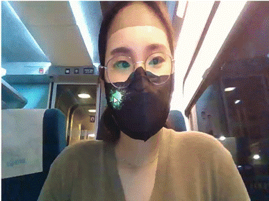

# Putting “Decals” on face

- Period : 2022.03.23 - 2022.06.18
- Semester : 4-1
- Team Member : 최은영, 강민석, 박형빈
- Subject : 얼굴에 decal 붙이기

---

### Goals
본 프로젝트는 mediapipe를 활용하여 얼굴을 detection하고 만들어진 facemesh에 decal을 붙여, 마치 실제 얼굴에 스티커를 붙이는 것처럼 증강현실 어플리케이션을 구현한다. 이때, decal은 데칼코마니아(decalcomania)의 줄임말로 한쪽 면에 디자인이 새겨진 종이 조각을 뜻한다. 

## Project Stack
- Stack :      
- API : [Mediapipe](https://developers.google.com/mediapipe)

## Fuction
- Raycasting
- Find optimal vertex on facemesh landmarks 
- Update Decals to stick on facemesh well 
- How to make and manage multi-decals 
- How to make Decals stick and tear around the eyes and mouth
- How to apply decals’s size appropriately

## Reference
- Three.js Example :
https://threejs.org/examples/?q=decal#webgl_decals
- Three.js Community : https://discourse.threejs.org/t/solved-problem-with-decal-normals/8257
- Three.js DecalGeometry.js : 
https://github.com/spite/THREE.DecalGeometry
